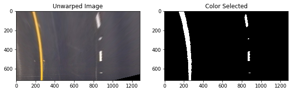

## Udacity Self-Driving Car Nanodegree

## Project #4: Advanced Lane Finding

RESUBMISSION based on review 484723

* Fixed erratic lane painting on/near bridge
* Fixed distance from center calc

#### Samuel Rustan
February Cohort

### Advanced Lane Finding Project

The goals / steps of this project are the following:

* Compute the camera calibration matrix and distortion coefficients given a set of chessboard images.
* Apply a distortion correction to raw images.
* Use color transforms, gradients, etc., to create a thresholded binary image.
* Apply a perspective transform to rectify binary image ("birds-eye view").
* Detect lane pixels and fit to find the lane boundary.
* Determine the curvature of the lane and vehicle position with respect to center.
* Warp the detected lane boundaries back onto the original image.
* Output visual display of the lane boundaries and numerical estimation of lane curvature and vehicle position.

#### 1. Camera Calibration (Using Chessboard reference images)

The code used to calibrate the camera is contained in the second and third code cell of the IPython notebook.
Camera calibration is performed by implementing the "findChessboardCorners" method from the opencv library.
The 3D coordinates of the chessboard corners are stored in object point arrays. Note that "objp" is just a replicated array of coordinates, and "objpoints" is appended with a copy of it every time a chessboard corner is successfully detected in a test image. The "imgpoints" are appended with the (x, y) pixel position of each of the corners in the image plane with each successful chessboard detection.
The object points (objpoints) and image points (imgpoints) are then used to compute the camera calibration, including the distortion coefficients (mtx, dist), by implementing the cv2.calibrateCamera from opencv.

#### 2. Distortion Correction

The code for distortion correction demonstration is in code cells 4 and 5.
The distortion parameters were applied to a sample image from the test_images set.
The opencv method "cv2.undistort()" was implemented in an "undistort()" function.  
The undisort function reads in an image, loads a previously pickled calibration file, then using the distortion parameters (mtx and dist) implements the cv2.undisort method to return the undistorted image.

It can be somewhat difficult to discern between the original "distorted" image and the "undistorted" image.  However, for the images shown, notice the car hood (on bottom of image) and the white car for appreciable effects.

Note the car hood and the white car for appreciable effects.

#### 3. Image Thresholding with Binary Output

Image Thresholding functions are defined in sixth code cell and demonstrations of the thresholding is done in the seventh code cell.  The thresholding functions, abs_sobel_thresh(), dir_thresh(), and mag_thresh() were all supplied in the lesson material.  The color channel functions, hsv_thresh() and hls_thresh() were modified with a "channel selection" option provided as input to the function.

These thresholding functions were used during experimentation of image thresholding and the effect on processing the video output.  After some discussion with another Udacity student, I decided to implement a much more straight forward "color select" with binary output to highlight lane lines from the image/video.  This is demonstrated in the 11th code cell in the perspective transform section.

Shown here is the thresholding applied without the binary output.  

The color binary thresholding is show here.  The code producing this output is in code cell 8.

#### 4. Perspective Transform

The image "unwarp" or perspective transform is implemented in code cell 9 and 10.
The function perspective_tf() is used to generate the M matrix, the M inverse matrix and returns the "warped" image, which is the "birds-eye-view" of the original image view.  The source points were manually obtained and the destination points were calculated from the length and width of the undistored image.

Shown here is the original view image (undistored) and the perspective transformed image.
The src and dst points are also plotted (in green) for the original and transformed images respectively.

Binary Thresholding on Unwarped Image

In code cell 11, the color_select() function (mentioned earlier) is implemented for thresholding and producing a binary output of the lanes from the perspective transform.  The color select relies on sensitivites for the selection of either white or yellow lane lines.  This color select function seemed to offer higher performance in processing the video than did the other thresholding functions.  This performance increase was by observation only, no statiscal data has been taken to prove this at this time.  

Shown here is the perspective transformed "Unwarped Image" and the color-select binary output "Color Selected" plotted in grayscale.

In code cell 12, lane line selection criteria a histogram of the color selected points is shown here.

With this histogram the pixel values are summed along each column in the image. In the thresholded binary image, pixels are either 0 or 1, so the two most prominent peaks in this histogram will be good indicators of the x-position of the base of the lane lines. This can be used as a starting point to search for the lines. From that point, a sliding window can be placed around the line centers, to find and follow the lines up to the top of the frame.

#### 5. Detect Lane Lines

The lane_finder function is in code cell 19, following steps were used in the creation of that function, but are split out here to make each contribution explicit.  The final code for the lane_finder function may differ slightly from these separated code demonstrations, but the end functionality is the same.  This is exemplified in code cell 22, where the output of the process_image function is applied to the test image.

Code cell 13 contains the code for the initial lane line detection 
For actual lane detection, the lane_finder()function uses a "sliding window" technique to The implementaion of the sliding windows technique is taken from the lesson material.

Shown here is the output of the lane_finder() function.  
The function returns a set of values (out_img, left_fitx, right_fitx, ploty, left_fit, right_fit) that are used to produce the following output.

In code cell 16, new lane lines are then redrawn but not from a blind search, but instead from a margin around the previous line position.

An 80px margin is used here.  New lane lines shown here with the cv2.fillPoly() implemented.

#### Determine Radius of Curvature

The radius of curvature calculation is performed in the lane_finder function. The calculations were performed using the following maths:

need to insert graphic of the math here!

#### Draw Lane onto original image, include Radius info

The new lane identification poly in green, the radius of curvature and the distance from center calculation are all drawn back onto the original image.

#### Implement video image processing

The final implementation on the video is the process_image pipeline.

From the video frame, the image is undistorted, then color selected, then perspective transofrm is applied.  The result of the perspective transform is then input to the lane_finder, which returns the processed image result to be added to the output video.

The link to the video output is here: https://youtu.be/HYmVUdAiXQI

The an example of the output from this pipeline is shown here.

#### Conclusions / Discussion

The approach I took was to find a very straight-forward implementation of the color selection/thresholding and sliding window technique.  This seems to have been successful based on the project video output.  There are some issues, however when applied to the optional challenge video.  I think here is where futher refinement of the pipeline may come into play.  I had some difficultly with the Lines class provided and for the project video, decided not to implement it.  

Some of the problems I encountered were with the parameter/threshold tweeking for the varying light conditions or color consistencies in the lane lines themselves.  One of the smaller issues that I faced, was that the src points for the perspective transform were too wide.  This caused the lane_finder to occasionally select the next lane over --painting both lanes as one.  This lead me to think that this lane-finding-pipeline will break down during lane changes.

Some improvements to consider would be to invalidate some of the fits if they don't meet certain criteria.  Video frame smoothing would possibly improve the output, especially where the lane-lines are suddenly absent (like right near a bridge or train tracks).  

Further improvements for making the algorithm more robust could include dynamic thresholding, statistical confidence calculations, as well as methods to handle lane changing and multi-lane classification.

